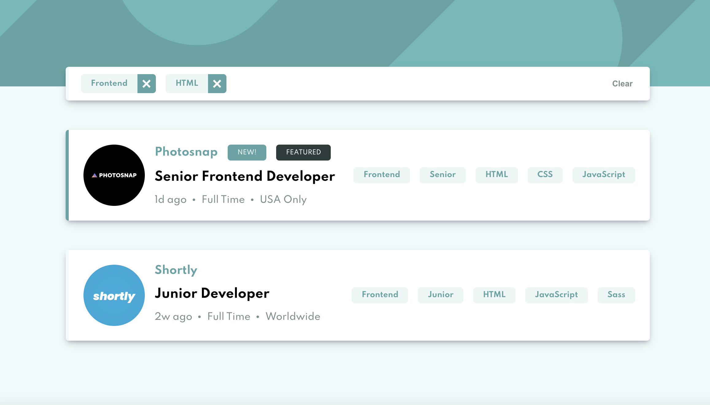

# Frontend Mentor - Job listings with filtering solution

This is a solution to the [Job listings with filtering challenge on Frontend Mentor](https://www.frontendmentor.io/challenges/job-listings-with-filtering-ivstIPCt). Frontend Mentor challenges help you improve your coding skills by building realistic projects. 

## Table of contents

- [Overview](#overview)
  - [The challenge](#the-challenge)
  - [Screenshot](#screenshot)
  - [Links](#links)
- [Author](#author)

## Overview

### The challenge

Users should be able to:

- View the optimal layout for the site depending on their device's screen size
- See hover states for all interactive elements on the page
- Filter job listings based on the categories

### Screenshot

### Links

- Solution URL: [Code on GitHub](https://github.com/michey85/dashboard-app)
- Live Site URL: [Live on Vercel](https://dashboard-app-coral.vercel.app/)

## Built with

- React 17 Hooks
- Redux
- Flexbox
- CSS custom properties
- Mobile-first workflow

## Author

- Website - [mishanep.com](https://mishanep.com)
- Frontend Mentor - [@michey85](https://www.frontendmentor.io/profile/michey85)
- Twitter - [@pcgramota](https://www.twitter.com/pcgramota)
- YouTube Channel [@МихаилНепомнящий](https://www.youtube.com/channel/UCFq12kPZg4wTNPO7V_g3B-A)
